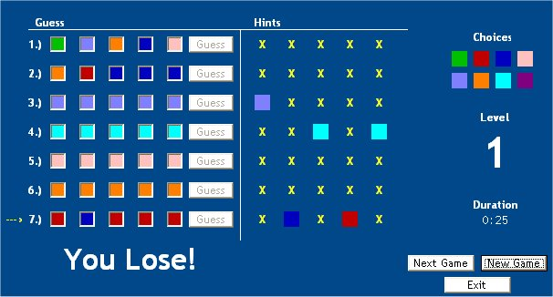



## Break The Code Game

### Description

Break The Code is a basic windows game. You have to guess a password that is encrypted using colors.
 
### More Info
 

             |
---                |---
**Submitted On**   |2002-10-09 14:19:12
**By**             |[Zach O'Brien](https://github.com/Planet-Source-Code/PSCIndex/blob/master/ByAuthor/zach-o-brien.md)
**Level**          |Beginner
**User Rating**    |5.0 (10 globes from 2 users)
**Compatibility**  |VB 6\.0
**Category**       |[Games](https://github.com/Planet-Source-Code/PSCIndex/blob/master/ByCategory/games__1-38.md)
**World**          |[Visual Basic](https://github.com/Planet-Source-Code/PSCIndex/blob/master/ByWorld/visual-basic.md)
**Archive File**   |[Break\_The\_1527241112003\.zip](https://github.com/Planet-Source-Code/zach-o-brien-break-the-code-game__1-42341/archive/master.zip)

